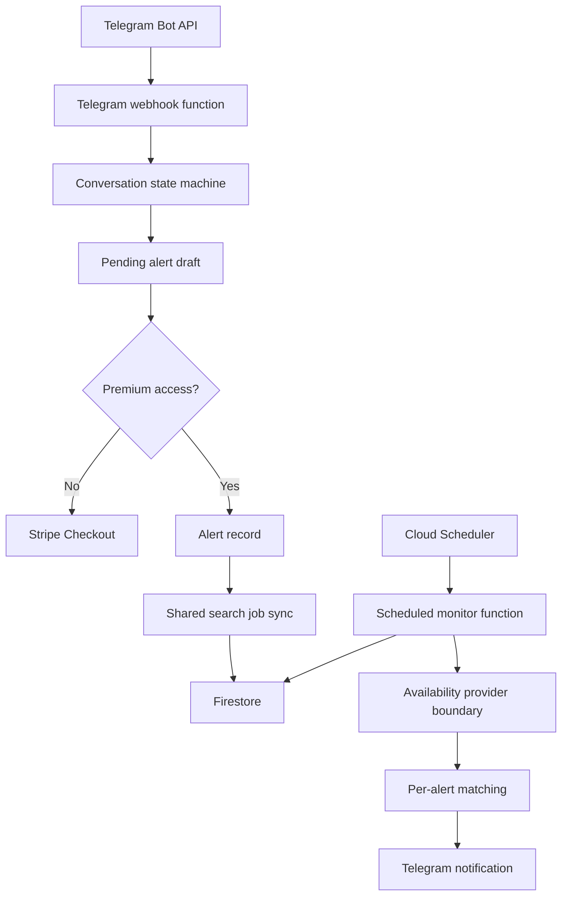
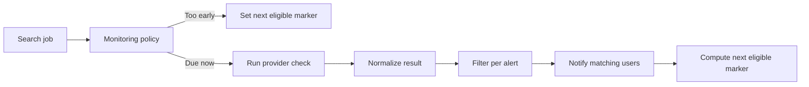

# EuroSnap Architecture Notes

This document describes the public, high-level architecture of EuroSnap. It intentionally omits private provider details, production deployment internals, secret configuration, admin tooling, and billing implementation code.

## System Overview

EuroSnap is organized around four responsibilities:

- Collect alert criteria through Telegram.
- Persist alert and user state.
- Check eligible shared monitoring jobs.
- Notify users when offers match their criteria.

## Core Entities

**Telegram user**

Stores identity, onboarding state, premium state, subscription references, pending alert draft, and notification metadata.

**Alert**

Stores one user's monitoring criteria: route, date, time preference, seat preference, optional departure windows, max price, and notification history.

**Shared search job**

Stores a route/date monitoring job shared by one or more alerts. The private backend checks a shared job once, then filters the result for every active alert attached to that job.

**Provider result**

Represents normalized availability returned by the private availability provider boundary. The public repo only includes the interface shape, not the real provider implementation.

## Data Flow

1. A user starts the bot and selects route/date/time/price criteria.
2. The backend saves a draft while the alert is being assembled.
3. If the user has premium access, the draft becomes an active alert.
4. The alert is attached to a shared search job based on route/date.
5. A scheduled function periodically loads due jobs.
6. The provider boundary returns normalized offer data.
7. The matching layer filters offers against each alert.
8. Telegram notifications are sent only for new matching offers.

## Scheduling Strategy

The production scheduler runs frequently, but the policy layer decides whether each job is eligible at that moment.

This keeps the system responsive near travel dates while avoiding unnecessary checks too early.

## Why Shared Jobs Matter

If ten users monitor Paris to Amsterdam on the same date, the backend should not perform ten identical route/date checks. EuroSnap separates the expensive route/date check from the user-specific filters.

This means the system can scale more cleanly:

- one provider check per shared route/date job
- many per-user filters in memory
- separate notification dedupe per alert

## Public Showcase Boundaries

This public repository includes enough material to understand the architecture and coding style, but it intentionally excludes:

- production Firebase Functions entrypoints
- Firestore write logic
- Telegram webhook controller
- Stripe webhook and checkout implementation
- private availability provider implementation
- admin dashboard
- operational scripts
- secrets and deployment config

That boundary is deliberate: the public repo demonstrates the engineering approach without making the product cloneable.
