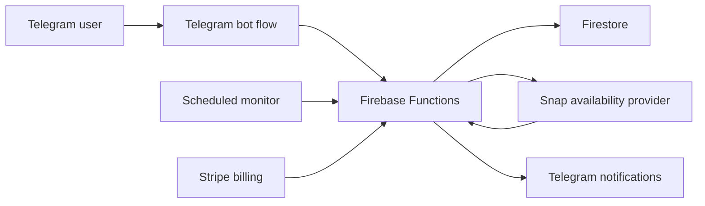

# Eurosnap | Eurostar Snap Alerts Telegram Bot

EuroSnap is a live Telegram bot that monitors Eurostar Snap availability and sends fast alerts when matching last-minute train offers appear.

You set your dates, route & price → and get notified as soon as a matching deal appears 🎟️

✨ €1.99/month

♾️ Unlimited alerts

🚨 Up to 3 active alerts at once


👉 Website: https://eurosnapbot.com/

👉 Bot: https://t.me/Eurosnapbot


## What EuroSnap Does

Eurostar Snap tickets can appear, disappear, and change quickly. EuroSnap helps users stop refreshing manually by letting them create automated Telegram alerts.

A user can choose:

- a Eurostar Snap route
- a travel date
- a preferred time slot
- a seat preference on supported routes
- optional departure-window filters
- an optional maximum price

When the production system finds a matching offer, the bot sends a clear Telegram notification with the price, trip details, and booking link.

## Why This Repository Is Partial

This repository is a public technical showcase. It is intentionally not the full production codebase and cannot be cloned to run the real bot.

The private production system includes Firebase Functions, Firestore persistence, Telegram webhooks, Stripe billing, Eurostar Snap availability providers, admin tooling, support tooling, operational scripts, and private configuration. Those pieces are not published here to protect the product, users, and operational security.

What this repo does provide is a credible view of the engineering style: architecture notes, public website source, Remotion animation code, anonymized mock data, diagrams, and selected non-runnable TypeScript excerpts.

## Technical Highlights

- Firebase Functions v2 handles scheduled monitoring, Telegram webhook entrypoints, and billing redirects in production.
- Firestore stores Telegram users, alert criteria, shared search jobs, notification state, and support tickets.
- Telegram Bot API powers the user flow, alert setup, inline buttons, and offer notifications.
- Stripe Checkout and Billing Portal manage the subscription flow.
- Shared route/date jobs reduce duplicate checks when several users monitor similar trips.
- Policy-based scheduling changes cadence based on proximity to travel date and seat source.
- Notification deduplication prevents users from receiving the same matching offer repeatedly.
- Remotion/React is used for product video generation and marketing assets.

## Architecture

The production system follows a simple pattern: Telegram collects user intent, Firestore stores alert state, a scheduler checks due shared jobs, and matching results are sent back through Telegram.



More detailed diagrams are available in:

- [Architecture notes](./ARCHITECTURE.md)
- [Alert creation flow](./showcase/diagrams/alert-creation-flow.md)
- [Monitoring flow](./showcase/diagrams/monitoring-flow.md)

## What Is Included

- `public/`: the public EuroSnap website source that is already visible online.
- `video-remotion/`: Remotion/React source for a EuroSnap promo animation.
- `showcase/backend-excerpts/`: selected TypeScript excerpts inspired by the private backend.
- `showcase/diagrams/`: Mermaid diagrams showing the high-level flows.
- `showcase/mock-data/`: anonymized example Firestore-style records.

## Backend Showcase

The backend excerpts are intentionally limited. They show the shape of the system without exposing production entrypoints, providers, database writes, billing internals, or admin tooling.

Included examples:

- simplified domain types
- monitoring-window and cadence policy
- per-alert offer filtering
- safe Telegram message formatting
- provider interface design without real scraping/parsing logic
- illustrative tests for policy and filtering behavior

These files are useful for code review and portfolio purposes, but they are not enough to run the EuroSnap production bot.

## Product Design Decisions

**Shared search jobs**

Several users may monitor the same route and date with different preferences. Instead of checking once per user, the private backend groups compatible alerts into shared route/date jobs and filters the result for each alert.

**Policy-based checks**

The bot does not check every alert constantly. In production, eligibility is decided by route group, seat source, travel date, and the current Europe/Paris time window.

**Offer-level deduplication**

After a matching offer is sent, the alert can keep monitoring. The user is notified again only when a different matching offer appears, such as another time slot, price, or seat source.

**Paid access**

The live bot uses a low-cost subscription model. Premium access is currently €1.99/month, giving users access to automated monitoring instead of manual checking.

## Repository Structure

```text
.
├── ARCHITECTURE.md
├── public/
│   └── Static website files
├── video-remotion/
│   └── Remotion promo video source
└── showcase/
    ├── backend-excerpts/
    │   └── Non-runnable TypeScript excerpts
    ├── diagrams/
    │   └── Mermaid flow diagrams
    └── mock-data/
        └── Anonymized Firestore-style examples
```

## Running The Included Public Pieces

The public website can be opened directly from `public/index.html`.

The Remotion video source can be explored from `video-remotion/`:

```console
npm install
npm run dev
```

The backend excerpt files are not wired as a deployable backend. They are intentionally published as readable, isolated engineering examples.

## Links

- Live bot: https://t.me/Eurosnapbot
- Website: https://eurosnap-422cf.web.app

## Disclaimer

EuroSnap is an independent project and is not affiliated with Eurostar.
