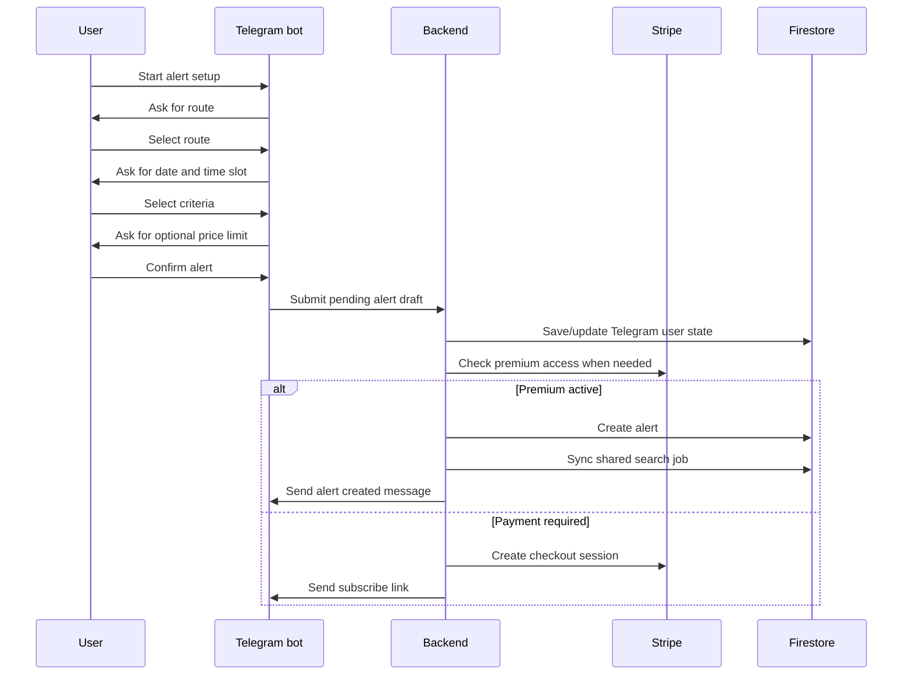

# Alert Creation Flow

This diagram shows the public high-level alert creation flow. It is simplified and does not include private implementation details.

## Notes

- The real production conversation has more validation and edge-case handling.
- Payment and webhook internals are intentionally omitted from the public repository.
- The shared search job is synced after alert creation so future checks can be grouped.
