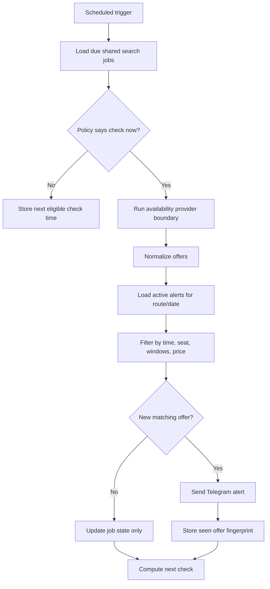

# Monitoring Flow

This diagram shows how EuroSnap avoids checking every alert independently.

## Notes

- The provider boundary is private and not included here.
- Filtering is per alert, but fetching is shared by route/date.
- Notification dedupe is per alert, so users can keep monitoring without duplicate spam.
